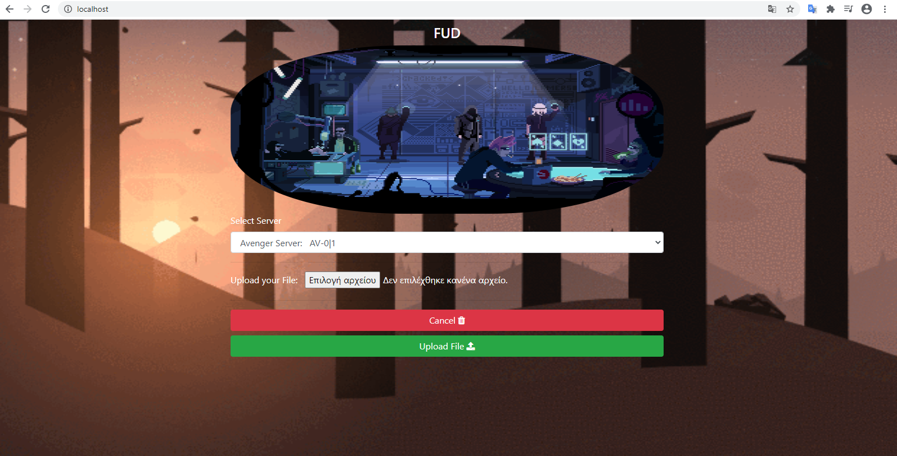
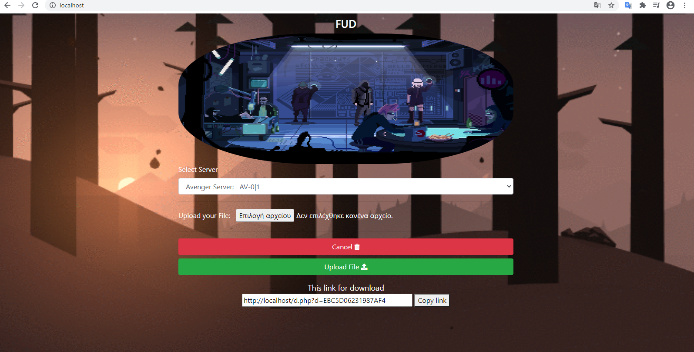
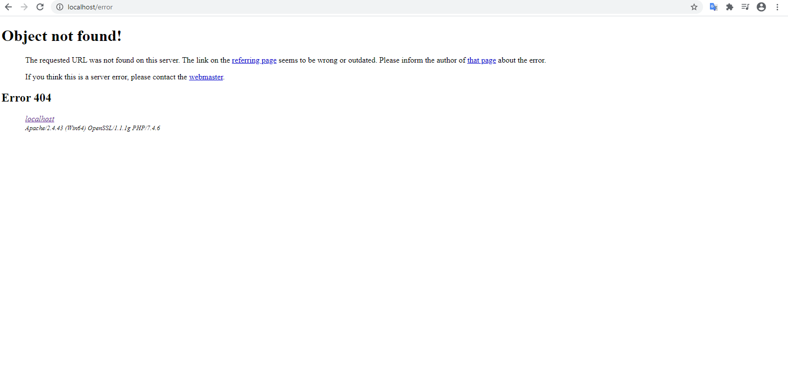

# fud
fud is a program upload and download files for one-time  

The files are not stored at all on the server but on base at server in a blob table encrypted with a key.  
The file is decrypted during download.  
If someone hacks the database the files are encrypted, they can not be opened.  

      

      

      

The file is available for download only once, then deleted auto  

      

